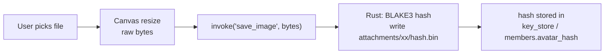
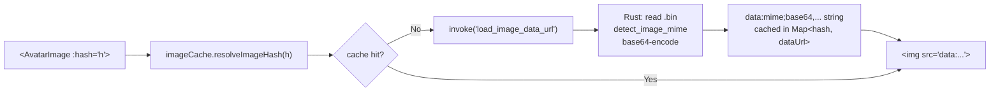
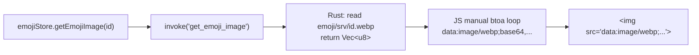
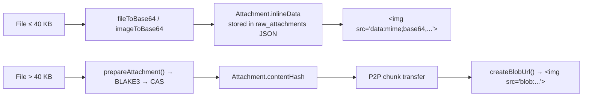
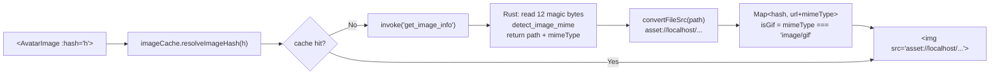
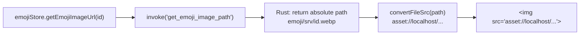
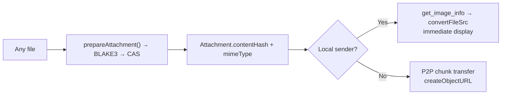
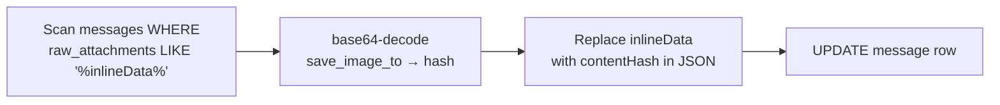

# Image Serving: Data URL → Asset Protocol

> **For agentic workers:** REQUIRED SUB-SKILL: Use superpowers:subagent-driven-development (recommended) or superpowers:executing-plans to implement this plan task-by-task. Steps use checkbox (`- [ ]`) syntax for tracking.

**Goal:** Replace every base64 data URL round-trip for images with Tauri's native asset protocol (`convertFileSrc`), drop the deprecated `avatar_data_url`/`banner_data_url` DB columns, extend the same optimization to emoji images, and remove the message attachment inline-data path entirely.

**Architecture:** One new Rust command (`get_image_info`) returns the absolute file path + MIME type for a CAS hash. The TypeScript `imageCache` converts that path to an `asset://localhost/...` URL via `convertFileSrc`. `AvatarImage` reads MIME type from the cache result for GIF detection (no callsite changes needed). Emoji images already live on disk at a predictable path; a new `get_emoji_image_path` command exposes the path. Message attachments drop the ≤40 KB inline-data path; all files go through `prepareAttachment` → CAS; a one-time Rust migration converts existing DB inline-data records to CAS hashes.

**Tech Stack:** Rust (tauri v2, rusqlite), TypeScript/Vue 3.5, Pinia 3, `@tauri-apps/api/core` `convertFileSrc`

---

## Why this matters

Current flow for every cache miss:

| Step | What happens | Cost |
|------|--------------|------|
| Rust | `read(file)` → `base64_encode` → prepend MIME header | 1 allocation @ 133% original size |
| IPC | full base64 string transferred over IPC bridge | wire copy |
| JS | `imageCache` stores data URL string | heap copy |
| Browser | `` re-decodes base64 → bitmap | decode + copy |

With `asset://`, the browser loads the file directly: one OS read → one decode, zero IPC.

---

## Current image data flow

**Upload (shared by all image types)**



**Avatar / Banner display (current)**



**Emoji display (current)**



**Message attachments (current)**



---

## Proposed image data flow

**Upload (unchanged)**


**Avatar / Banner display (new)**



**Emoji display (new)**



**Message attachments (new — inline removed)**



**One-time startup migration (existing inline-data records)**



---

## File Map

### New Files
| File | Responsibility |
|------|---------------|
| `src-tauri/migrations/012_drop_data_url_cols.sql` | `ALTER TABLE members DROP COLUMN avatar_data_url/banner_data_url` |

### Modified Files
| File | Changes |
|------|---------|
| `src-tauri/src/commands/attachment_commands.rs` | Add `get_image_info` command + `ImageInfo` struct; add `migrate_attachment_inline_data` startup command; remove `load_image_data_url` from `invoke_handler` (keep function body for tests until deleted) |
| `src-tauri/src/commands/db_commands.rs` | Add `get_emoji_image_path` command; update `db_upsert_member` + `db_load_members` SQL to exclude data_url columns; update `db_save_emoji` SQL (no schema change needed) |
| `src-tauri/src/commands/archive_commands.rs` | Remove `avatar_data_url`, `banner_data_url` from member archive export/import |
| `src-tauri/src/db/types.rs` | Remove `avatar_data_url`, `banner_data_url` from `MemberRow`; add `ImageInfo` return struct |
| `src-tauri/src/lib.rs` | Register `get_image_info`, `get_emoji_image_path`, `migrate_attachment_inline_data`; remove `load_image_data_url` registration |
| `src-tauri/capabilities/default.json` | Add `core:asset:allow` scope for `$APPDATA/**` |
| `src-tauri/tauri.conf.json` | Add `asset:` (macOS/Linux) + `https://asset.localhost` (Windows) to CSP `img-src` |
| `src/utils/imageCache.ts` | Change IPC call; change cache type to `Map<hash, {url, mimeType}>`; update return type |
| `src/components/AvatarImage.vue` | Update for `{url, mimeType}` cache; `isGif = mimeType === 'image/gif'`; remove `data:` detection |
| `src/stores/emojiStore.ts` | `getEmojiImage` → `get_emoji_image_path` + `convertFileSrc`; remove manual btoa |
| `src/stores/serversStore.ts` | Remove `avatar_data_url` reads/writes from `fetchMembers`, `upsertMember` |
| `src/types/core.ts` | Remove `avatarDataUrl`/`bannerDataUrl` from `ServerMember`; remove `inlineData` from `Attachment`; remove `'inline'` from `transferState` union |
| `src/components/chat/MessageInput.vue` | Remove inline path; always call `prepareAttachment`; remove `MAX_INLINE_BYTES` and `fileToBase64`/`imageToBase64` inline calls |
| `src/components/chat/AttachmentPreview.vue` | Remove `inlineData` render branch; all attachments use blob URL or asset:// URL |
| `src/services/syncService.ts` | Remove `inlineData` stripping from `_pushItems`; keep general byte-size guard |

---

## Task 1 — Rust: `get_image_info` command

**Files:** `src-tauri/src/commands/attachment_commands.rs`, `src-tauri/src/db/types.rs`, `src-tauri/src/lib.rs`

- [ ] **Step 1: Write a failing Rust unit test**

  In `attachment_commands.rs` `#[cfg(test)]` block, add:

  ```rust
  #[test]
  fn test_get_image_info_returns_path_and_mime() {
      use tempfile::TempDir;
      let tmp = TempDir::new().unwrap();
      // Write a minimal PNG magic byte sequence (8 bytes)
      let png_magic = b"\x89PNG\r\n\x1a\n";
      // This test validates detect_image_mime and bin_path logic
      // Full integration test lives in e2e; here we unit-test path construction
      let hash = "deadbeef".to_string();
      let dir = tmp.path().to_path_buf();
      let expected = dir.join("de").join("deadbeef.bin");
      assert_eq!(bin_path(&dir, &hash), expected);
  }
  ```

  Run `cd src-tauri && cargo test get_image_info` — confirms test harness works; expect pass.

- [ ] **Step 2: Add `ImageInfo` struct to `db/types.rs`**

  ```rust
  #[derive(serde::Serialize)]
  pub struct ImageInfo {
      pub path:      String,
      pub mime_type: String,
  }
  ```

- [ ] **Step 3: Add `get_image_info` command to `attachment_commands.rs`**

  Below the existing `save_image` command, add:

  ```rust
  #[tauri::command]
  pub fn get_image_info(
      app_handle: tauri::AppHandle,
      content_hash: String,
  ) -> Result<crate::db::types::ImageInfo, String> {
      let dir = attachments_dir(&app_handle)?;
      let path = bin_path(&dir, &content_hash);
      // Read only enough bytes for MIME detection (12 bytes covers all magic headers)
      let mut f = std::fs::File::open(&path).map_err(|e| e.to_string())?;
      let mut magic = [0u8; 12];
      use std::io::Read;
      let _ = f.read(&mut magic);
      let mime = detect_image_mime(&magic);
      Ok(crate::db::types::ImageInfo {
          path:      path.to_string_lossy().to_string(),
          mime_type: mime.to_string(),
      })
  }
  ```

  > **Note:** `detect_image_mime` currently takes a full `&[u8]` slice. Verify its signature accepts a 12-byte slice; adjust if it expects the full file buffer (read 12 bytes, pass `&magic[..]`).

- [ ] **Step 4: Register command in `lib.rs`**

  Add `attachment_commands::get_image_info` to the `invoke_handler![]` macro.
  Do **not** remove `load_image_data_url` from the handler yet — it stays until Task 3 is complete and tests pass.

- [ ] **Step 5: Run `cargo check`** — confirm zero errors. Fix any borrow/type issues.

---

## Task 2 — Asset protocol: capabilities + CSP

**Files:** `src-tauri/capabilities/default.json`, `src-tauri/tauri.conf.json`

> **IMPORTANT:** Before editing, look up the exact Tauri v2 asset protocol permission identifier via Context7:
> `resolve-library-id "tauri"` → `query-docs "asset protocol convertFileSrc capabilities permission identifier v2"`.
> The identifiers below are the expected values but must be verified.

- [ ] **Step 1: Add asset protocol scope to `capabilities/default.json`**

  Add to the `permissions` array:
  ```json
  {
    "identifier": "core:asset:allow",
    "allow": [{ "path": "$APPDATA/**" }]
  }
  ```

  This allows the asset protocol to serve any file under the app data directory (covers `attachments/**` and `emoji/**`).

- [ ] **Step 2: Update CSP in `tauri.conf.json`**

  Current `img-src`: `'self' data: blob: https://cdn.jsdelivr.net`

  Replace with: `'self' data: blob: asset: https://asset.localhost https://cdn.jsdelivr.net`

  - `asset:` covers macOS and Linux (`asset://localhost/...`)
  - `https://asset.localhost` covers Windows

- [ ] **Step 3: Smoke-test manually**

  Run `npm run dev:tauri`. Open DevTools, run in console:
  ```js
  const { convertFileSrc } = window.__TAURI__.core;
  const url = convertFileSrc('C:\\path\\to\\any.png'); // or /path/to/any.png
  console.log(url); // expect asset://localhost/... or https://asset.localhost/...
  const img = new Image(); img.src = url; img.onload = () => console.log('works!');
  document.body.appendChild(img);
  ```
  Confirm image loads with no CSP error in console.

---

## Task 3 — `imageCache.ts`: switch to `get_image_info` + `convertFileSrc`

**Files:** `src/utils/imageCache.ts`, `src/utils/__tests__/imageCache.test.ts` (create if absent)

- [ ] **Step 1: Write a failing unit test**

  Create `src/utils/__tests__/imageCache.test.ts`:

  ```ts
  import { vi, describe, it, expect, beforeEach } from 'vitest'
  vi.mock('@tauri-apps/api/core', () => ({
    invoke: vi.fn(),
    convertFileSrc: (path: string) => `asset://localhost${path}`,
  }))

  describe('resolveImageHash', () => {
    beforeEach(() => {
      vi.clearAllMocks()
      // Reset module cache between tests
      vi.resetModules()
    })

    it('returns { url: asset://, mimeType } for a known hash', async () => {
      const { invoke } = await import('@tauri-apps/api/core')
      vi.mocked(invoke).mockResolvedValue({
        path: '/fake/path/de/deadbeef.bin',
        mime_type: 'image/png',
      })
      const { resolveImageHash } = await import('../imageCache')
      const result = await resolveImageHash('deadbeef')
      expect(result).toEqual({
        url: 'asset://localhost/fake/path/de/deadbeef.bin',
        mimeType: 'image/png',
      })
      expect(invoke).toHaveBeenCalledWith('get_image_info', { contentHash: 'deadbeef' })
    })

    it('returns null for empty hash', async () => {
      const { resolveImageHash } = await import('../imageCache')
      const result = await resolveImageHash('')
      expect(result).toBeNull()
    })

    it('caches results and does not call invoke twice', async () => {
      const { invoke } = await import('@tauri-apps/api/core')
      vi.mocked(invoke).mockResolvedValue({ path: '/fake/a.bin', mime_type: 'image/png' })
      const { resolveImageHash } = await import('../imageCache')
      await resolveImageHash('abc123')
      await resolveImageHash('abc123')
      expect(invoke).toHaveBeenCalledTimes(1)
    })
  })
  ```

  Run `npm run test` — expect 3 failures (function not yet implemented).

- [ ] **Step 2: Update `imageCache.ts`**

  Change the cache type and resolution logic:

  ```ts
  import { invoke, convertFileSrc } from '@tauri-apps/api/core'

  interface ImageEntry {
    url: string
    mimeType: string
  }

  const cache = new Map<string, ImageEntry>()
  const inflight = new Map<string, Promise<ImageEntry | null>>()

  export async function resolveImageHash(hash: string): Promise<ImageEntry | null> {
    if (!hash) return null
    if (cache.has(hash)) return cache.get(hash)!
    if (inflight.has(hash)) return inflight.get(hash)!

    const p = (async () => {
      try {
        const info = await invoke<{ path: string; mime_type: string }>('get_image_info', { contentHash: hash })
        const entry: ImageEntry = {
          url: convertFileSrc(info.path),
          mimeType: info.mime_type,
        }
        cache.set(hash, entry)
        return entry
      } catch (e) {
        console.warn('[imageCache] failed to resolve hash', hash, e)
        return null
      } finally {
        inflight.delete(hash)
      }
    })()

    inflight.set(hash, p)
    return p
  }

  export function evictImageHash(hash: string): void {
    cache.delete(hash)
    inflight.delete(hash)
  }

  export type { ImageEntry }
  ```

  > **Note:** Export the `ImageEntry` type so `AvatarImage.vue` and `emojiStore.ts` can import it with proper typing.

- [ ] **Step 3: Run tests** — expect all 3 to pass. Run `npm run build` — expect zero TypeScript errors (there will be type errors at `AvatarImage.vue` callsites; fix those in Task 4).

---

## Task 4 — `AvatarImage.vue`: update for `ImageEntry` return type + GIF detection

**Files:** `src/components/AvatarImage.vue`

- [ ] **Step 1: Read the current `AvatarImage.vue`** to understand all computed refs and template logic before editing.

- [ ] **Step 2: Update `<script setup>` block**

  - Change the type of `hashResolvedSrc` from `Ref<string | null>` to `Ref<{ url: string; mimeType: string } | null>`
  - Import `ImageEntry` from `../utils/imageCache`
  - Where `resolveImageHash` result is stored, the returned value is now `ImageEntry | null`
  - Add a `resolvedMimeType` computed:

    ```ts
    const resolvedMimeType = computed(() =>
      hashResolvedSrc.value?.mimeType ?? ''
    )
    ```

  - Change `resolvedSrc` computed:
    ```ts
    const resolvedSrc = computed(() =>
      hashResolvedSrc.value?.url ?? props.src ?? ''
    )
    ```

  - Change `isGif` computed (currently `resolvedSrc.value.startsWith('data:image/gif')`):
    ```ts
    const isGif = computed(() =>
      resolvedMimeType.value === 'image/gif' ||
      (props.src?.startsWith('data:image/gif') ?? false)
    )
    ```

    The `props.src` fallback handles any legacy callers that still pass a GIF data URL directly (should be none after Task 6, but safe to keep).

- [ ] **Step 3: Run `npm run build`** — fix any remaining TypeScript errors in this file. The `isGif` Canvas first-frame extraction logic (`drawImage` etc.) is unchanged since `asset://` images load via the `Image()` constructor like any other URL (no CORS barrier since it's a trusted local file).

---

## Task 5 — Drop `avatar_data_url` / `banner_data_url`

**Files:** SQL migration, `types.rs`, `db_commands.rs`, `archive_commands.rs`, `core.ts`, `serversStore.ts`

- [ ] **Step 1: Create `src-tauri/migrations/012_drop_data_url_cols.sql`**

  ```sql
  -- Phase 1 (image hashes, migration 011) fully populated avatar_hash and banner_hash.
  -- The legacy data URL columns are safe to remove.
  ALTER TABLE members DROP COLUMN avatar_data_url;
  ALTER TABLE members DROP COLUMN banner_data_url;
  ```

  > SQLite supports `ALTER TABLE ... DROP COLUMN` from version 3.35 (2021). Bundled `rusqlite` ships a recent SQLite; confirm version with `SELECT sqlite_version();` in `inspect-dbs.mjs` if unsure.

- [ ] **Step 2: Add migration to Rust migrations runner**

  In `src-tauri/src/db/migrations.rs`, add the new `.sql` file as the next `M::up(include_str!(...))` entry after 011.

- [ ] **Step 3: Remove fields from `MemberRow` in `db/types.rs`**

  Delete the two fields:
  ```rust
  pub avatar_data_url: Option<String>,
  pub banner_data_url: Option<String>,
  ```

- [ ] **Step 4: Update `db_load_members` SQL in `db_commands.rs`**

  Remove `avatar_data_url` and `banner_data_url` from the `SELECT` column list and update the `row.get(n)` index numbers for all subsequent fields.

- [ ] **Step 5: Update `db_upsert_member` SQL in `db_commands.rs`**

  Remove `avatar_data_url` and `banner_data_url` from the `INSERT OR REPLACE` column list and `params![]`.

- [ ] **Step 6: Remove fields from `archive_commands.rs`**

  Search `archive_commands.rs` for `avatar_data_url` and `banner_data_url` — remove from both the export query and any import `INSERT` statement.

- [ ] **Step 7: Remove `avatarDataUrl` / `bannerDataUrl` from `src/types/core.ts`**

  In the `ServerMember` interface, delete:
  ```ts
  avatarDataUrl?: string
  bannerDataUrl?: string
  ```

- [ ] **Step 8: Remove all reads/writes from `src/stores/serversStore.ts`**

  Search for `avatar_data_url`, `banner_data_url`, `avatarDataUrl`, `bannerDataUrl` — remove all occurrences (reads from `MemberRow`, writes in `upsertMember`, fallback assignment in `fetchMembers`).

- [ ] **Step 9: Run `cargo check` + `npm run build`** — expect zero errors. Fix type errors as they surface.

- [ ] **Step 10: Remove `migrate_data_urls_to_files` command** (formerly needed for the transition period)

  - Delete the function from `attachment_commands.rs`
  - Remove from `invoke_handler` in `lib.rs`
  - Confirm no TS callsite remains (`grep -r "migrate_data_urls_to_files" src/`)

---

## Task 6 — Emoji images via `get_emoji_image_path` + `convertFileSrc`

**Files:** `src-tauri/src/commands/db_commands.rs`, `src-tauri/src/lib.rs`, `src/stores/emojiStore.ts`

- [ ] **Step 1: Add `get_emoji_image_path` Rust command to `db_commands.rs`**

  ```rust
  #[tauri::command]
  pub fn get_emoji_image_path(
      app_handle: tauri::AppHandle,
      emoji_id: String,
      server_id: String,
  ) -> Result<String, String> {
      use tauri::Manager;
      let app_dir = app_handle
          .path()
          .app_data_dir()
          .map_err(|e| e.to_string())?;
      let file_path = app_dir
          .join("emoji")
          .join(&server_id)
          .join(format!("{}.webp", emoji_id));
      Ok(file_path.to_string_lossy().to_string())
  }
  ```

  > The `.webp` extension is hardcoded consistently in `db_save_emoji`, `get_emoji_image`, and `store_emoji_image`. No change needed there.

- [ ] **Step 2: Register `get_emoji_image_path` in `lib.rs` `invoke_handler`**

  Keep `get_emoji_image` registered until `emojiStore.ts` is updated and tests pass, then remove its registration in Step 4.

- [ ] **Step 3: Update `src/stores/emojiStore.ts`**

  The existing `getEmojiImage(id, serverId)` function:
  - Currently: `invoke('get_emoji_image', { emojiId, serverId })` → returns `number[]` → manual `btoa` loop → `data:image/webp;base64,...`
  - New: `invoke('get_emoji_image_path', { emojiId: id, serverId })` → `convertFileSrc(path)` → `asset://localhost/...`

  Replace the function body:
  ```ts
  import { invoke, convertFileSrc } from '@tauri-apps/api/core'

  async function getEmojiImage(id: string, serverId: string): Promise<string> {
    const cached = imageCache.value.get(id)
    if (cached) return cached
    const path = await invoke<string>('get_emoji_image_path', { emojiId: id, serverId })
    const url = convertFileSrc(path)
    imageCache.value.set(id, url)
    return url
  }
  ```

  Also update the `receiveEmojiImage` handler (if it exists) that calls `store_emoji_image` — that path is unchanged (the file is written to disk, so `convertFileSrc` will work immediately after).

- [ ] **Step 4: Remove `get_emoji_image` registration from `lib.rs`**

  Once `emojiStore.ts` no longer calls `get_emoji_image`, remove it from the invoke handler. Keep the Rust function body in case it's called elsewhere (search `src/` for `get_emoji_image` to confirm no other callers).

- [ ] **Step 5: Run `npm run build` + `cargo check`** — confirm zero errors.

---

## Task 7 — Remove message attachment inline-data path

**Files:** `src/types/core.ts`, `src/components/chat/MessageInput.vue`, `src/components/chat/AttachmentPreview.vue`, `src/services/syncService.ts`, `src-tauri/src/commands/attachment_commands.rs`, `src-tauri/src/lib.rs`

> **Dependency:** Tasks 1–3 must be complete (CAS images can now be served via `asset://`). Task 7 removes the last `inlineData` path.

- [ ] **Step 1: Remove `inlineData` from `Attachment` type in `src/types/core.ts`**

  Delete:
  ```ts
  inlineData?: string
  ```
  From the `transferState` union, remove `'inline'`:
  ```ts
  transferState: 'pending' | 'uploading' | 'complete' | 'failed'
  // (remove 'inline' if present)
  ```

- [ ] **Step 2: Update `MessageInput.vue` — remove inline path**

  In `buildAttachment()`:
  - Delete the `if (file.size <= MAX_INLINE_BYTES)` branch and everything inside it (`fileToBase64`, `imageToBase64`, `inlineData` assignment)
  - The `else` branch (call `prepareAttachment`) becomes unconditional
  - Remove `MAX_INLINE_BYTES` constant (or lower it to 0 if referenced elsewhere)
  - Remove unused imports: `fileToBase64`, `imageToBase64`
  - For the local sender preview after `prepareAttachment`: if the attachment has a `contentHash`, resolve via `get_image_info` + `convertFileSrc` to display immediately (or use a blob URL from the original `File` object before upload — `URL.createObjectURL(file)` — which is already how the optimistic preview likely works)

- [ ] **Step 3: Update `AttachmentPreview.vue` — remove inline display branch**

  Remove any conditional block that checks `attachment.inlineData` and renders ``.

  Ensure the remaining path (P2P chunk transfer → `createBlobUrl()` or `asset://`) covers all cases.

- [ ] **Step 4: Update `syncService.ts` — remove `inlineData` stripping**

  In `_pushItems()`, the code that strips `inlineData` from `raw_attachments` when an item exceeds `ITEM_BUDGET`:
  - Remove the inlineData-specific stripping logic
  - **Keep** the general byte-size guard (the `SCTP_SAFE_BYTES` / `ITEM_BUDGET` check) to protect against any other oversized payloads
  - Since `inlineData` no longer exists in new messages, the guard is now only a safety net for edge cases

- [ ] **Step 5: Add Rust startup migration for existing inline-data records**

  In `attachment_commands.rs`, add a new command:

  ```rust
  #[tauri::command]
  pub async fn migrate_attachment_inline_data(
      state: tauri::State<'_, AppState>,
      app_handle: tauri::AppHandle,
  ) -> Result<u32, String> {
      use base64::{Engine as _, engine::general_purpose::STANDARD};

      let conn = state.db.lock().map_err(|e| e.to_string())?;

      // Collect rows that have inlineData anywhere in raw_attachments
      let mut stmt = conn.prepare(
          "SELECT id, raw_attachments FROM messages
           WHERE raw_attachments IS NOT NULL
             AND raw_attachments LIKE '%inlineData%'"
      ).map_err(|e| e.to_string())?;

      #[derive(Debug)]
      struct Row { id: String, raw: String }
      let rows: Vec<Row> = stmt.query_map([], |r| {
          Ok(Row { id: r.get(0)?, raw: r.get(1)? })
      }).map_err(|e| e.to_string())?
        .collect::<Result<Vec<_>, _>>()
        .map_err(|e| e.to_string())?;
      drop(stmt);

      let mut converted = 0u32;

      for row in rows {
          let mut attachments: Vec<serde_json::Value> =
              serde_json::from_str(&row.raw).map_err(|e| e.to_string())?;
          let mut changed = false;
          for att in &mut attachments {
              if let Some(inline_data) = att.get("inlineData").and_then(|v| v.as_str()) {
                  // Strip MIME prefix (data:image/png;base64,AAAA → AAAA)
                  let b64 = inline_data.splitn(2, ',').nth(1).unwrap_or(inline_data);
                  let bytes = STANDARD.decode(b64).map_err(|e| e.to_string())?;
                  let hash = save_image_to(&app_handle, bytes)?;
                  att.as_object_mut().unwrap().remove("inlineData");
                  att["contentHash"] = serde_json::Value::String(hash);
                  att["transferState"] = serde_json::Value::String("complete".into());
                  changed = true;
              }
          }
          if changed {
              let new_raw = serde_json::to_string(&attachments).map_err(|e| e.to_string())?;
              conn.execute(
                  "UPDATE messages SET raw_attachments = ?1 WHERE id = ?2",
                  rusqlite::params![new_raw, row.id],
              ).map_err(|e| e.to_string())?;
              converted += 1;
          }
      }

      log::info!("[migrate_attachment_inline_data] converted {} rows", converted);
      Ok(converted)
  }
  ```

  > **Rust note:** `save_image_to` currently takes `app_handle: &tauri::AppHandle` and `bytes: Vec<u8>`. Adjust call signature to match. If `AppState` mutex is already locked above, ensure the lock is dropped before calling `save_image_to` (which doesn't need DB access).

- [ ] **Step 6: Call `migrate_attachment_inline_data` at app startup**

  In `src/main.ts` or an app-init store action (wherever `migrate_data_urls_to_files` was called):
  ```ts
  // Run once at startup; idempotent — safe to call on every launch
  invoke('migrate_attachment_inline_data').catch(e =>
    console.warn('[startup] inline-data migration failed:', e)
  )
  ```

- [ ] **Step 7: Register `migrate_attachment_inline_data` in `lib.rs`**

- [ ] **Step 8: Run `cargo check` + `npm run build`** — fix any remaining errors.

- [ ] **Step 9: Manual smoke test** — create a fresh test server, send an image attachment, confirm it displays properly. If you have an existing DB with inlineData rows, confirm they are converted on startup and still display.

---

## Self-Review Checklist

- [ ] `cargo check` passes with zero warnings
- [ ] `npm run build` (`vue-tsc --noEmit && vite build`) passes with zero errors
- [ ] `npm run test` — all tests green (imageCache, emojiStore, AvatarImage)
- [ ] `cargo test` — all Rust tests pass
- [ ] No `load_image_data_url` IPC calls remain in frontend (`grep -r "load_image_data_url" src/`)
- [ ] No `inlineData` references remain in frontend source (`grep -r "inlineData" src/`)
- [ ] No `avatar_data_url` / `banner_data_url` references remain in frontend or Rust source
- [ ] `get_emoji_image` (old) no longer registered in `lib.rs` `invoke_handler`
- [ ] `migrate_data_urls_to_files` no longer registered in `lib.rs`
- [ ] Asset protocol smoke-test passes (image visible in DevTools without CSP error)
- [ ] GIF avatars still animate; hover pauses (Canvas first-frame path intact)
- [ ] Custom emoji images render correctly in picker and in messages
- [ ] Existing DB inline-data attachments converted on startup and display correctly
- [ ] New image attachments (post-migration) always go through `prepareAttachment`
- [ ] `docs/TODO.md` Follow-up checkboxes marked complete

---

## Task Order

Execute in strict order — each task depends on the previous:

```
Task 1 (Rust get_image_info)
  → Task 2 (capabilities + CSP)
    → Task 3 (imageCache.ts)
      → Task 4 (AvatarImage.vue)
        → Task 5 (drop data URL cols) ← independent of Task 6/7, can parallelize with Tasks 6/7 after Task 4
        → Task 6 (emoji via convertFileSrc)
        → Task 7 (remove inline attachment path)
```

Tasks 5, 6, and 7 are independent of each other and can be assigned to parallel subagents after Task 4 completes.

---

## Ready to Execute?

Reply with:
- **"Execute with subagents"** → use `superpowers:subagent-driven-development` skill to fan out Tasks 5/6/7 in parallel after Tasks 1–4
- **"Execute inline"** → use `superpowers:executing-plans` skill to work through all tasks sequentially in this session
